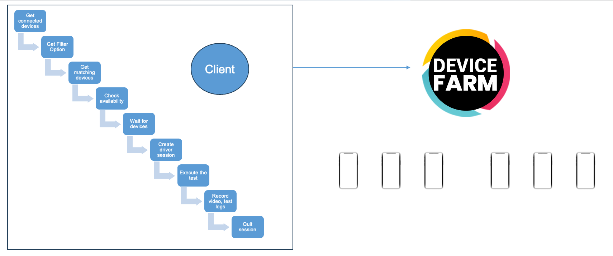
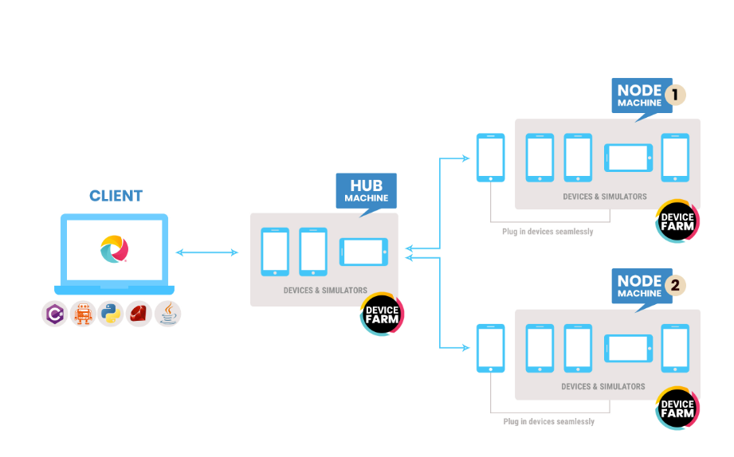

## This framework consists of:
- Selenium 4.9.1
- Java 11
- JUnit 5
- Maven 3.8.1
- Allure Report 2.14.0
- Allure JUnit4 2.14.0

# Table of Contents
1. [Test command](#command)
2. [Appium Devices Farm](#devices_farm)
3. [Test Flow](#Test_Flow)
4. [Parallelism](#Parallelism)
5. [Allure Report](#allure)
6. [Known Issue](#issues)

## Run Test Command <a name="command"></a>
**Run with remote Appium**
- Provide environment variable for **_remote_appium_** and **_remote_appium_port_**
```
    mvn clean test -Dremote_appium=127.0.0.1 -Dremote_appium_port=4723
```

**Filter test by tags**
- Run tests which tagged with `YoutubeSearch` and exclude tagged with `random tag`

```
    mvn clean test -Dgroups="YoutubeSearch" -DexcludedGroups="random tag" 
```

- Run tests which tagged with `random tag` or  `YoutubeSearch`
```
    mvn test -Dgroups="random tag | YoutubeSearch"
```

- Run tests which tagged both `random tag` and  `YoutubeSearch`
```
    mvn test -Dgroups="random tag & YoutubeSearch"
```

### Appium Device Farm <a name="devices_farm"></a>
- **Prerequisite**: Appium version 2.0.X

- **Install plugins:**
```
    appium plugin install --source=npm appium-device-farm
    appium plugin install --source=npm appium-dashboard
```

- **How to activate the plugins**:
Base on specific needs, the device farm could be activated by platform options
```
    appium server -ka 800 --use-plugins=device-farm,appium-dashboard  -pa /wd/hub --plugin-device-farm-platform=android
    appium server -ka 800 --use-plugins=device-farm,appium-dashboard  -pa /wd/hub --plugin-device-farm-platform=ios
    appium server -ka 800 --use-plugins=device-farm,appium-dashboard  -pa /wd/hub --plugin-device-farm-platform=both
```

- **With default config**:
  * Device portal would be located at : http://127.0.0.1:4723/device-farm/ ( Managing connected devices with current Appium hub & appium nodes)
  * Dashboard would be located at : http://127.0.0.1:4723/dashboard/ ( Managing sessions of connected devices with current Appium hub & appium nodes)
- **Custom Config**: With server arguments here https://appium-device-farm-eight.vercel.app/server-args/
  
- **Usage**: The idea is to flexibly manage devices & session
  * Appium devices: Manage connected devices & existing sessions on that hub
  * Test Script: Provide FilterOption ( condition to filter needed device for that specific test case), then query on server to create driver session
```java
public FilterOptions(String name, String udid, String platform, String platformVersion, boolean busy, boolean realDevice) {
    this.name = name;
    this.udid = udid;
    this.platform = platform;
    this.platformVersion = platformVersion;
    this.busy = busy;
    this.realDevice = realDevice;
    }
    FilterOptions myFilter = new FilterOptions("", "", "ios", "", true, true);
    appiumDriver = DriverManager.getMobileDriver(myFilter);
```
- **Test Flow**:<a name="Test_Flow"></a>


  * Get FilterOption on Test scripts (Before Each/Within test case)
  * Get Connected Devices on Hub
  * Compare and pick 1st matched of (FilterOption vs Connected Devices)
      * If FilterOption does not match with Connected Devices List -> Return error No matching Device
      * If that device is available -> Create new session
      * If that device is busy -> Change to next matched devices and repeat loop
  * Once test run complete -> Driver.quit -> Wait for Appium server available with post steps clean up
  * Screenshots and recorded video is stored at http://127.0.0.1:4723/dashboard/ by session iD
  * **Advance setup**:
    * **Appium hub** : Hub is a server that accepts access requests from the WebDriver client, routing the W3C test commands to the remote drives on nodes. It takes instructions from the client and executes them remotely on the various nodes in parallel
    * **Appium node server**: Node is a remote machine that consists of devices and appium server running with device-farm active. It receives requests from the hub in the form of W3C test commands and executes them using WebDriver


### Parallelism on Junit5 <a name="Parallelism"></a>

- Requirement: Create `junit-platform.properties` file in `src/test/resources`
- Run test one by one  
```properties
junit.jupiter.execution.parallel.mode.default = same_thread
junit.jupiter.execution.parallel.mode.classes.default = same_thread
```
or
```properties
junit.jupiter.execution.parallel.enabled = false
```
- Run test parallel by Class, test method sequentially _(current implementation does not support this mode for device farm yet)_
```properties
junit.jupiter.execution.parallel.enabled = true
junit.jupiter.execution.parallel.mode.default = same_thread
junit.jupiter.execution.parallel.mode.classes.default = concurrent
```
- Run parallel test method within test class, but each class run separately
```properties
junit.jupiter.execution.parallel.enabled = true
junit.jupiter.execution.parallel.mode.default = concurrent
junit.jupiter.execution.parallel.mode.classes.default = same_thread
```
- Run every test parallel _(current implementation does not support this mode for device farm yet)_
```properties
junit.jupiter.execution.parallel.enabled = true
junit.jupiter.execution.parallel.mode.default = concurrent
junit.jupiter.execution.parallel.mode.classes.default = concurrent
```
- Custom Parallel Strategy:
 Update _`src/test/java/automation/example/demo/features/CustomStrategy.java`_ to fix number of test thread
### Allure Report <a name="allure"></a>
- Install Allure Report
```shell
  brew install allure
```

- Open Allure Report: _allure serve [path/to/allure-results]_
```shell
  allure serve target/allure-results
```

- Generate clean report folder: _allure generate [path/to/allure-results] --clean --output [path/to/allure-report]_
```shell
  allure generate target/allure-results --clean --output allure-report
```

### Known Issues <a name="issues"></a>
1. **IOS Tracking**:
We have two options to install go-ios module to manage iOS devices
   - Option1 --> If you want device-farm to help you download go-ios module. Run command `appium plugin run device-farm install-go-ios`
   - Option2 --> You can install the go-ios module with `npm install -g go-ios`
     - We need to set the environment variable.
           After installing with Option2 --> `GO_IOS="/usr/local/lib/node_modules/go-ios/dist/{ SELECT YOUR OS }/ios"`
2. Currently, Parallelism only support:
   - Run parallel test method within test class, but each class run separately
3. Current implementation is not optimized for `waitForAvailableDevice()`. 
   - If your server include both Android & iOS device, you have to control number of requested devices <= connected devices.
   - If you separate Server for Android and iOS, there is no issue with the waitForDevice logics